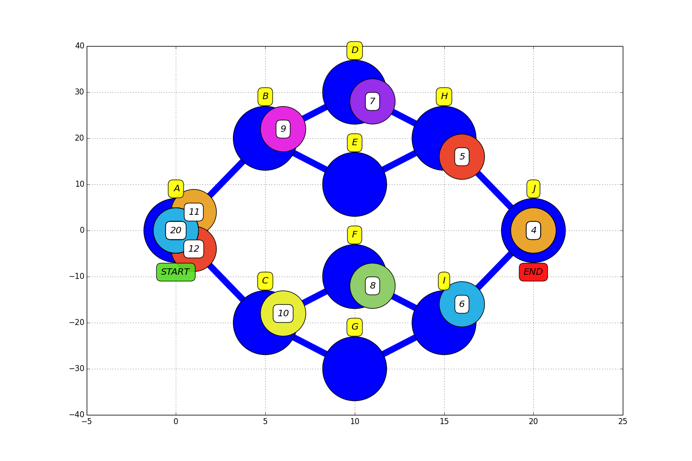
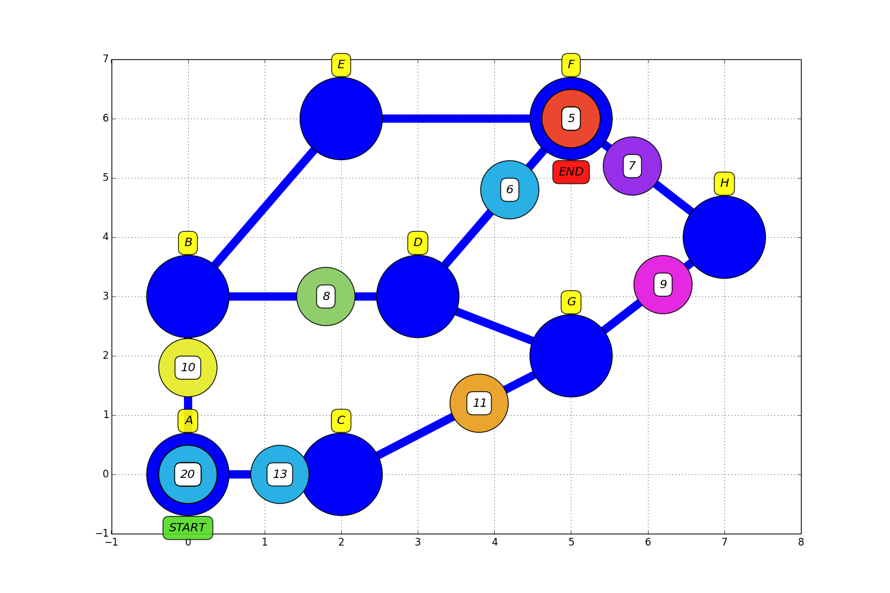

## 42 school algorithm project lem-in.
The goal of the project is: to move ants across ant farm with **minimum** number of instructions.

The ants farm describes in input file like below:
<pre><code>10       -  number of ants
##start  -
1 23 3    |
2 16 7    |
#comment  |
3 16 3    |
4 16 5    | name and coordinates of the rooms
5 9 3     | 
6 1 5     |
7 4 8     |
##end     |
0 9 5    -
0-4      -
0-6       |
1-3       |
4-3       |
5-2       |
3-5       | tunnels between rooms
#comment  |
4-2       |
2-1       |
7-6       |
7-2       |
7-4       |
6-5      -</pre></code>

### usage: ./lem-in < [map file]

Output should be something like this: 
<pre><code>L1-2
L1-3 L2-2
L1-1 L2-3 L3-2
L2-1 L3-3
L3-1</pre></code>

Where each line is one time step.  
L1-3 means: <code>ant number 1 goes to the room number 3</code>.  
Only one ant can be at the room in the same time.

To visualize graph:
./run.sh [map file] [interval in ms]

_python2.x and matplotlib required_

Examples:

./run.sh testing/farm1 40

./run.sh testing/farm2 40

